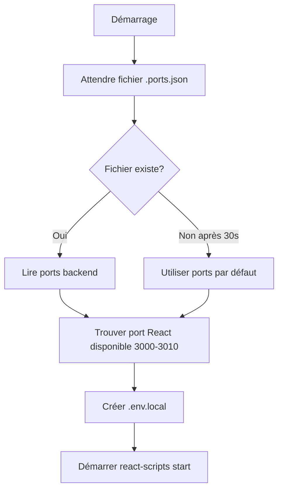

# Analyse Démarrage et Runtime - RDS Viewer Anecoop

**Date:** 2025-11-02  
**Version Analysée:** 3.0.26  
**Node.js Requis:** v18.x ou v20.x (actuellement v18.19.0)

---

## 📋 Table des Matières

1. [Checklist de Démarrage](#checklist-de-démarrage)
2. [Compatibilité Node.js](#compatibilité-nodejs)
3. [Analyse Scripts de Démarrage](#analyse-scripts-de-démarrage)
4. [Problèmes Identifiés](#problèmes-identifiés)
5. [Séquence de Démarrage](#séquence-de-démarrage)
6. [Points Critiques](#points-critiques)
7. [Solutions et Recommandations](#solutions-et-recommandations)

---

## ✅ Checklist de Démarrage

### Prérequis Système

- [x] **Node.js v18.x ou v20.x** installé
- [ ] **Python** installé (pour compilation native modules)
- [ ] **Build tools Windows** installés (`npm install -g windows-build-tools`)
- [x] **npm** à jour (inclus avec Node.js)

### Vérifications Backend

- [ ] **Serveur démarré**: `node server/server.js`
- [ ] **Base de données accessible**: Log `✅ Base de données SQLite connectée`
- [ ] **Configuration chargée**: Log `✅ Configuration chargée`
- [ ] **Ports disponibles**: 3002 (HTTP), 3003 (WebSocket)
- [ ] **API répond**: `curl http://localhost:3002/api/config`
- [ ] **Chemin réseau accessible**: `\\192.168.1.230\Donnees\...` (si configuré)

### Vérifications Frontend

- [ ] **React dev server démarré**: Port 3000-3010
- [ ] **Fichier .env.local créé** automatiquement
- [ ] **Connexion API établie**: Vérifier console navigateur
- [ ] **WebSocket connecté**: Log dans console dev

### Vérifications Base de Données

- [ ] **Fichier SQLite existe** et est accessible
- [ ] **Permissions lecture/écriture** OK
- [ ] **Mode WAL activé** (pour accès concurrent)
- [ ] **Tables créées**: 11 tables (computers, loans, users, etc.)

---

## 🔧 Compatibilité Node.js

### Version Actuelle Détectée
```bash
Node.js: v18.19.0
Platform: linux (x64)
NODE_MODULE_VERSION: 108
```

### Modules Natifs Critiques

#### better-sqlite3
**Version:** ^12.4.1  
**Problème Fréquent:** Incompatibilité ABI Node.js

**Symptôme:**
```
❌ Error: The module 'better_sqlite3.node' was compiled against 
   NODE_MODULE_VERSION 130 (Node v22). This version requires 
   NODE_MODULE_VERSION 127 (Node v20).
```

**Solution Automatique:**
```bash
npm run check:deps
# Recompile automatiquement better-sqlite3 si nécessaire
```

**Gestion Automatique:**
- Script `scripts/check-dependencies.js` vérifie au démarrage
- Recompilation automatique si échec du `require('better-sqlite3')`
- Validation post-rebuild

---

## 📝 Analyse Scripts de Démarrage

### 1. Script Principal: `start-react.js`

**Localisation:** `/scripts/start-react.js`  
**Rôle:** Démarrage intelligent du serveur React avec gestion des ports

#### Séquence d'Exécution



#### Fonctionnalités Clés

1. **Attente Backend (30s max)**
   - Surveille création de `.ports.json` par le serveur
   - Timeout non bloquant: continue avec ports par défaut

2. **Allocation Port React**
   - Teste ports 3000-3010
   - Utilise `portUtils.isPortAvailable()`
   - Échoue si aucun port disponible

3. **Génération .env.local**
   ```env
   PORT=3000
   REACT_APP_API_URL=http://localhost:3002/api
   REACT_APP_WS_URL=ws://localhost:3003
   BROWSER=none
   GENERATE_SOURCEMAP=true
   ```

4. **Gestion Signaux**
   - SIGINT (Ctrl+C): fermeture propre
   - SIGTERM: arrêt gracieux

#### Points d'Attention

⚠️ **Timeout de 30 secondes** peut être insuffisant sur machines lentes  
⚠️ **Dépendance à portUtils**: si module manquant, échec silencieux  
⚠️ **Cross-platform spawn**: utilise `npm.cmd` sur Windows

---

### 2. Script de Vérification: `check-dependencies.js`

**Localisation:** `/scripts/check-dependencies.js`  
**Rôle:** Validation et recompilation de better-sqlite3

#### Logique

```javascript
1. Tenter require('better-sqlite3')
2. Si échec:
   a. Afficher message clair
   b. Exécuter npm rebuild better-sqlite3
   c. Re-vérifier fonctionnement
   d. Si toujours échec: process.exit(1)
3. Si succès: continuer démarrage
```

#### Tests Effectués

- ✅ Module chargeable
- ✅ ABI Node.js compatible
- ✅ Binaires natifs présents

#### Limitations

❌ **Ne teste PAS** l'accès à une vraie DB  
❌ **Ne vérifie PAS** les permissions fichiers  
❌ **Process.exit(1)** bloque tout le démarrage

---

### 3. Script de Build: `build-versioned.js`

**Localisation:** `/scripts/build-versioned.js`  
**Rôle:** Build avec auto-incrémentation de version

#### Séquence

```
1. Lire package.json
2. Incrémenter version patch (3.0.26 → 3.0.27)
3. Sauvegarder package.json
4. Exécuter npm run build:exe
5. Générer .exe dans /dist
```

#### Production

```bash
npm run build:versioned
# Génère: RDS Viewer Anecoop-3.0.27-portable.exe
```

---

## 🚨 Problèmes Identifiés

### 1. ✅ RÉSOLU - Boucle Infinie ERR_INSUFFICIENT_RESOURCES

**Statut:** Corrigé dans useDataFetching.js  
**Cause:** `fetchFunction` dans dépendances `useCallback`  
**Solution:** Utilisation de `useRef` pour référence stable

---

### 2. 🟡 EN COURS - Techniciens Connectés = 0

**Symptôme:** Widget affiche toujours 0 techniciens

#### Diagnostic Multi-Niveaux

**A. Base de Données**

Fichier SQLite attendu:
```
\\192.168.1.230\Donnees\Informatique\PROGRAMMES\Programme RDS\RDS Viewer Group\rds_viewer_data.sqlite
```

**Problèmes Potentiels:**
- ❌ Chemin réseau inaccessible depuis Node.js
- ❌ Permissions réseau insuffisantes
- ❌ Partage réseau non monté
- ❌ Firewall bloque accès SMB

**Vérification:**
```bash
node -e "const fs = require('fs'); const path='\\\\192.168.1.230\\Donnees\\...'; console.log(fs.existsSync(path));"
```

**B. Serveur Backend**

```bash
# Vérifier démarrage
curl http://localhost:3002/api/technicians/connected

# Log attendu au démarrage
✅ Base de données SQLite connectée : \\192.168.1.230\...
```

**C. Code d'Enregistrement**

**Frontend** → `LoginPage.js:73`
```javascript
apiService.login(username, password)
```

**Backend** → `apiRoutes.js:41`
```javascript
registerTechnicianLogin(userData)
```

**Service** → `technicianService.js:34-36`
```javascript
db.prepare(`INSERT INTO technician_presence...`).run()
```

**D. Table SQL**

```sql
SELECT * FROM technician_presence WHERE status = 'online';
-- Si vide = problème d'insertion
-- Si rempli = problème de lecture par frontend
```

---

### 3. 🔴 BLOQUANT - Guacamole Shadow/RDP Non Fonctionnel

**Symptôme:**
```
WebSocket connection to 'ws://localhost:8080/guacamole/websocket-tunnel' failed:
WebSocket is closed before the connection is established.
```

**Cause Racine:** Serveur Apache Guacamole NON démarré

#### Prérequis

**Installation Guacamole:**
```bash
# Docker (recommandé)
docker run -d -p 8080:8080 \
  --name guacamole \
  guacamole/guacamole
```

**Configuration:**

Fichier: `/etc/guacamole/guacamole.properties`
```properties
auth-provider: net.sourceforge.guacamole.net.auth.json.JSONAuthenticationProvider
json-secret-key: PBWmJHC2mKfvSUtc7eG7/d/QpPmeBrTAq9L6EgQHy+w=
```

Fichier: `config/config.json`
```json
{
  "guacamole": {
    "url": "http://localhost:8080/guacamole",
    "username": "guacadmin",
    "password": "guacadmin",
    "secretKey": "PBWmJHC2mKfvSUtc7eG7/d/QpPmeBrTAq9L6EgQHy+w="
  }
}
```

⚠️ **SECRET KEY DOIT ÊTRE IDENTIQUE** dans les 2 fichiers

**Vérification:**
```bash
curl http://localhost:8080/guacamole/
# Doit retourner HTML
```

---

### 4. 🟡 Gestion Ports Automatique

**Système Actuel:**

Plages testées:
- React: 3000-3010
- HTTP: 3002-3012
- WebSocket: 3003-3013

**Avantages:**
- ✅ Évite conflits ports
- ✅ Multi-instances possible
- ✅ Fichier `.ports.json` partagé

**Limites:**
- ⚠️ Si tous ports occupés: échec silencieux
- ⚠️ Pas de nettoyage `.ports.json` (PID mort)
- ⚠️ Timeout 30s peut être court

---

### 5. 🔵 CORS - Localhost vs 127.0.0.1

**Problème Résolu:**

Configuration CORS inclut désormais:
```javascript
function getAllowedOrigins() {
  return [
    'http://localhost:3000-3010',  // Variante hostname
    'http://127.0.0.1:3000-3010',  // Variante IP
  ];
}
```

**Raison:** React peut basculer entre localhost et 127.0.0.1

---

## 🔄 Séquence de Démarrage Complète

### Mode Développement (`npm run dev`)

```
┌─────────────────────────────────────────┐
│ 1. Concurrently démarre 2 processus    │
└─────────────────────────────────────────┘
           │
           ├──> SERVEUR BACKEND
           │    └─> node server/server.js
           │        ├─> Charge config.json
           │        ├─> Connecte SQLite
           │        ├─> Trouve ports disponibles
           │        ├─> Sauvegarde .ports.json
           │        ├─> Initialise WebSocket
           │        ├─> Démarre Express HTTP
           │        └─> Lance tâches de fond
           │
           └──> FRONTEND REACT
                └─> node scripts/start-react.js
                    ├─> Attend .ports.json (30s max)
                    ├─> Lit ports backend
                    ├─> Trouve port React libre
                    ├─> Génère .env.local
                    └─> Lance react-scripts start
```

### Durées Typiques

| Étape | Durée Normale | Max Acceptable |
|-------|---------------|----------------|
| Chargement config | < 100ms | 500ms |
| Connexion DB | < 200ms | 2s |
| Allocation ports | < 1s | 5s |
| Démarrage serveur | < 2s | 10s |
| Build React dev | 10-30s | 60s |
| **TOTAL** | **15-35s** | **80s** |

---

## ⚙️ Analyse `server/server.js`

### Initialisation

```javascript
// 1. Imports (5 lignes)
const express = require('express');
const configService = require('../backend/services/configService');
const databaseService = require('../backend/services/databaseService');
// ...

// 2. Variables globales
let API_PORT = 3002;
let WS_PORT = 3003;

// 3. Fonction startServer()
async function startServer() {
  // A. Détection mode production/dev
  const isProduction = process.env.NODE_ENV === 'production';
  
  // B. Allocation ports (dev only)
  if (!isProduction) {
    const ports = await findAllPorts({...});
    API_PORT = ports.http;
    WS_PORT = ports.websocket;
    await savePorts(ports); // Crée .ports.json
  }
  
  // C. Chargement configuration
  await configService.loadConfigAsync();
  if (!configService.isConfigurationValid()) {
    console.error("Démarrage en mode dégradé");
    // Continue quand même mais sans fonctionnalités
  }
  
  // D. Connexion base de données
  databaseService.connect(); // Mode synchrone
  // Exécute schema SQL
  // Lance migration si nécessaire
  
  // E. WebSocket
  initializeWebSocket(); // Sur WS_PORT
  
  // F. Routes API
  app.use('/api', apiRoutes(broadcast));
  
  // G. Tâches de fond
  startBackgroundTasks();
  
  // H. Écoute HTTP
  server.listen(API_PORT, callback);
}
```

### Points Critiques

#### 1. Configuration Invalide = Mode Dégradé

```javascript
if (!configService.isConfigurationValid()) {
  // ⚠️ Serveur démarre QUAND MÊME
  // Routes API présentes mais retournent erreurs
  // WebSocket fonctionne
  // Base de données NON initialisée
}
```

**Impact:** Application démarre mais non fonctionnelle

#### 2. Base de Données - Pas de Retry

```javascript
databaseService.connect(); // Synchrone
// Si échec: CRASH IMMÉDIAT
```

**Problème:** Chemin réseau temporairement indisponible = crash

**Recommandation:** Ajouter retry avec backoff

#### 3. Tâches de Fond - Démarrage Asynchrone

```javascript
startBackgroundTasks();
// Lance 5 intervalles:
// - Excel Sync: 10 min (1er après 5s)
// - RDS Sessions: 30s (1er après 2s)
// - Loan Check: 15 min (1er après 2s)
// - Technician Presence: 2 min (1er après 2s)
// - AD Status Cache: 5 min (1er après 15s)
```

**Bon:** Pas de blocage au démarrage  
**Attention:** Erreurs asynchrones peuvent être silencieuses

---

## 🎯 Points Critiques Runtime

### 1. Accès Chemin Réseau Windows

**Chemin Typique:**
```
\\192.168.1.230\Donnees\Informatique\PROGRAMMES\Programme RDS\RDS Viewer Group\
```

**Problèmes Potentiels:**

| Problème | Symptôme | Solution |
|----------|----------|----------|
| Partage non monté | `ENOENT` | Monter avec `net use` |
| Permissions | `EACCES` | Vérifier user Node.js |
| DNS/IP unreachable | Timeout | Ping serveur |
| Firewall | Connection refused | Autoriser SMB (445) |

**Test Manuel:**
```bash
# Windows CMD
dir \\192.168.1.230\Donnees

# Node.js
node -e "console.log(require('fs').existsSync('\\\\192.168.1.230\\Donnees'))"
```

---

### 2. Better-sqlite3 Compilation

**Quand Recompiler:**
- Changement version Node.js
- Installation sur nouvelle machine
- Après `npm ci` en CI/CD

**Automatisation:**
```json
{
  "scripts": {
    "postinstall": "npm run check:deps"
  }
}
```

---

### 3. WebSocket Stabilité

**Reconnection Client:**

Frontend doit implémenter:
```javascript
ws.onclose = () => {
  setTimeout(() => reconnect(), 5000);
};
```

**Healthcheck Serveur:**

Actuellement ABSENT. Recommandation:
```javascript
setInterval(() => {
  wss.clients.forEach(client => {
    if (!client.isAlive) return client.terminate();
    client.isAlive = false;
    client.ping();
  });
}, 30000);
```

---

## 🛠️ Solutions et Recommandations

### Immediate (Critique)

1. **✅ Ajouter Retry DB Connection**
   ```javascript
   async function connectWithRetry(maxRetries = 3) {
     for (let i = 0; i < maxRetries; i++) {
       try {
         databaseService.connect();
         return;
       } catch (err) {
         if (i === maxRetries - 1) throw err;
         await sleep(2000 * (i + 1));
       }
     }
   }
   ```

2. **✅ Valider Chemin Réseau au Démarrage**
   ```javascript
   if (!fs.existsSync(dbPath)) {
     console.error(`❌ Base de données inaccessible: ${dbPath}`);
     console.error("Vérifier:");
     console.error("- Serveur réseau accessible");
     console.error("- Permissions SMB");
     console.error("- Chemin dans config.json");
   }
   ```

3. **✅ Healthcheck WebSocket**
   Implémenter ping/pong comme ci-dessus

### Court Terme (Important)

4. **Monitoring Tâches de Fond**
   - Logger erreurs dans fichier dédié
   - Alertes si échecs répétés
   - Dashboard admin avec statut tâches

5. **Timeout Configurables**
   ```javascript
   const config = {
     BACKEND_WAIT_TIMEOUT: 30000,
     DB_CONNECT_TIMEOUT: 10000,
     TASK_ERROR_THRESHOLD: 5
   };
   ```

6. **Nettoyage .ports.json**
   ```javascript
   // Vérifier PID avant utilisation
   if (portsData.pid && !isProcessRunning(portsData.pid)) {
     fs.unlinkSync('.ports.json');
   }
   ```

### Long Terme (Amélioration)

7. **Logs Structurés**
   - Utiliser Winston ou Pino
   - Rotation automatique
   - Niveaux: error, warn, info, debug

8. **Mode Offline**
   - Base locale de secours
   - Sync quand réseau revient
   - Indicateur UI "Mode dégradé"

9. **Tests d'Intégration**
   - Démarrage simulé
   - Échec DB simulé
   - Échec réseau simulé

---

## 📊 Checklist Déploiement Production

### Avant Installation

- [ ] Node.js v18 ou v20 installé
- [ ] Permissions administrateur
- [ ] Ports 3002-3003 libres
- [ ] Accès réseau vérifié
- [ ] Firewall configuré (SMB, HTTP)

### Configuration

- [ ] `config/config.json` rempli
- [ ] Chemins réseau testés manuellement
- [ ] Credentials AD valides
- [ ] Guacamole installé et configuré
- [ ] SecretKey identique dans 2 fichiers

### Post-Installation

- [ ] Build réussi: `npm run build:versioned`
- [ ] Test démarrage: `npm run test:app`
- [ ] Connexion fonctionnelle
- [ ] Technicien apparaît dans widget
- [ ] Sessions RDS visibles
- [ ] Shadow RDP fonctionne

### Validation Runtime

- [ ] Serveur stable 1h
- [ ] Tâches de fond sans erreur
- [ ] WebSocket reconnecte après coupure
- [ ] DB accessible 100% du temps
- [ ] Logs propres (pas d'erreurs critiques)

---

## 📚 Références

- **Documentation Complète:** `/TROUBLESHOOTING.md`
- **Problèmes Connus:** `/DIAGNOSTIC_ET_SOLUTIONS.md`
- **Commandes NPM:** `/NPM-COMMANDS.md`
- **Gestion Ports:** `/PORT-MANAGEMENT.md`

---

## 🏁 Conclusion

### État Actuel: ⚠️ PARTIELLEMENT FONCTIONNEL

| Composant | État | Bloquant |
|-----------|------|----------|
| Serveur Backend | ✅ OK | Non |
| React Frontend | ✅ OK | Non |
| Base de Données | 🟡 Dépend réseau | Oui |
| WebSocket | ✅ OK | Non |
| Guacamole | 🔴 Non installé | Oui (pour RDP) |
| Tâches de fond | 🟡 Sans monitoring | Non |

### Priorités

1. **🔴 Critique:** Résoudre accès base de données réseau
2. **🔴 Critique:** Installer et configurer Guacamole
3. **🟡 Important:** Ajouter retry DB connection
4. **🟡 Important:** Monitoring tâches de fond
5. **🔵 Nice-to-have:** Logs structurés

### Délai Estimé de Mise en Production

- **Sans Guacamole:** 2-4h (résolution DB + tests)
- **Avec Guacamole:** 1-2 jours (installation + config + tests)

---

**Dernière Mise à Jour:** 2025-11-02  
**Auteur:** Analyse Automatisée  
**Prochaine Révision:** Après résolution problèmes critiques
